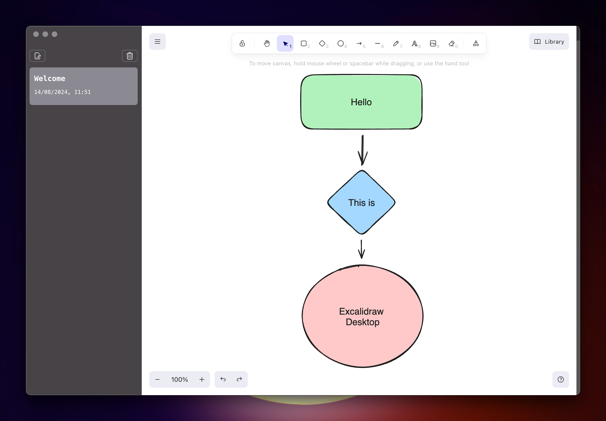

# Excalidraw Desktop

This is a desktop application that allows you to have the excalidraw editor local on your machine. It allows you to save and reopen excalidraw documents. It was developed using electron and react.



## Project Setup

### Install

```bash
$ npm install
```

### Development

```bash
$ npm run dev
```

### Build

```bash
# For windows
$ npm build:win

# For macOS
$ npm build:mac

# For Linux
$ npm build:linux
```
